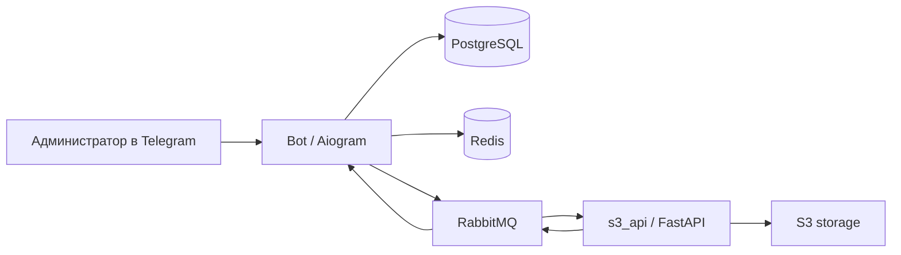

# Simple Template Sender Bot

Telegram-бот для шаблонных рассылок с админ-панелью, управлением шаблонами сообщений, списком получателей, статистикой отправок и сохранением результатов рассылки в объектное хранилище.

Проект построен как небольшой набор сервисов:
- **`bot`** — Telegram-бот на **Aiogram 3**;
- **`s3_api`** — API на **FastAPI** для загрузки и скачивания файлов из S3-совместимого хранилища;
- **`shared`** — общая библиотека с моделями БД, RabbitMQ, Redis и инфраструктурным кодом.

## Что умеет проект

- выдавать доступ к админ-панели через секретную фразу;
- создавать, редактировать, удалять и выбирать шаблоны сообщений;
- хранить список получателей;
- добавлять и удалять получателей текстом или файлом;
- запускать рассылку по выбранному шаблону;
- собирать статистику по успешным, неразрешённым и неотправленным сообщениям;
- сохранять CSV-отчёт по результатам рассылки в S3;
- обрабатывать сохранение результатов асинхронно через RabbitMQ;
- автоматически применять Alembic-миграции при старте бота.

## Как это работает

### Основной сценарий

1. Администратор получает доступ к панели через секрет.
2. Создаёт шаблон сообщения.
3. Загружает список username получателей.
4. Выбирает шаблон для рассылки.
5. Бот отправляет сообщения пользователям.
6. После завершения формируется CSV-отчёт:
   - успешно отправлено;
   - username не найден / пользователь не взаимодействовал с ботом / username изменился;
   - ошибка отправки.
7. CSV публикуется как команда в RabbitMQ.
8. Сервис `s3_api` принимает сообщение, загружает файл в S3 и публикует результат обратно.
9. Бот обновляет статус рассылки и даёт возможность скачать отчёт.

### Поток данных



## Стек

- **Python 3.14**
- **Aiogram 3**
- **FastAPI**
- **SQLAlchemy 2**
- **Alembic**
- **PostgreSQL**
- **Redis**
- **RabbitMQ**
- **aioboto3**
- **uv**
- **Docker / Docker Compose**

## Структура проекта

```text
.
├── app/
│   ├── bot/                  # Telegram-бот
│   └── s3_api/               # API для работы с S3
├── shared/                   # Общий код: БД, RabbitMQ, Redis
├── alembic/                  # Миграции базы данных
├── docker-compose.yml
├── Dockerfile
├── pyproject.toml            # uv workspace
└── config.py                 # Pydantic settings
```

## Админ-возможности

### Шаблоны
- создание шаблона;
- редактирование названия и текста;
- выбор шаблона для текущей рассылки;
- удаление шаблонов;
- постраничный просмотр списка шаблонов.

### Получатели
- просмотр сохранённого списка;
- добавление username сообщением;
- добавление username из файла;
- удаление username сообщением;
- удаление username из файла;
- выгрузка списка получателей;
- полная очистка списка.

### Рассылки
- запуск рассылки по выбранному шаблону;
- повторные попытки отправки при временных ошибках Telegram;
- сохранение результатов отправки;
- просмотр статистики по последним и всем рассылкам;
- скачивание CSV-отчёта.

## Конфигурация

Проект использует `pydantic-settings` и читает переменные окружения из файла `.env`.

В репозитории есть шаблон окружения **`.env.exmaple`**.

> Обрати внимание: файл назван именно `.env.exmaple` — с опечаткой в имени. Для запуска удобно просто скопировать его в `.env`.

Пример:

```bash
cp .env.exmaple .env
```

### Основные переменные окружения

```env
BOT_TOKEN=
BOT_SUPERADMIN_ID=
BOT_ADMIN_SECRET=

DB_HOST=postgres
DB_PORT=5432
DB_USERNAME=postgres
DB_PASSWORD=postgres
DB_NAME=bot_db

REDIS_HOST=redis
REDIS_PORT=6379
REDIS_DB=0

STORAGE_KEY_ID=
STORAGE_SECRET=
STORAGE_BUCKET_NAME=

RABBITMQ_HOST=rabbitmq
RABBITMQ_PASSWORD=
```

### Дополнительно

Бот поддерживает переменную:

```env
SKIP_MIGRATION=false
```

Если значение `false`, при старте автоматически запускается `alembic upgrade head`.

## Быстрый старт через Docker Compose

### 1. Подготовь `.env`

```bash
cp .env.exmaple .env
```

Заполни реальные значения для:
- токена Telegram-бота;
- S3-ключей;
- параметров БД и RabbitMQ при необходимости.

### 2. Собери и запусти сервисы

```bash
docker compose up -d --build
```

После запуска будут подняты:
- `bot`
- `s3_api`
- `postgres`
- `redis`
- `rabbitmq`

### 3. Проверь API

S3 API будет доступен на:

```text
http://localhost:8000
```

Проверка здоровья хранилища:

```text
GET /api/s3_health
```

## Локальный запуск без Docker

Ниже — базовый вариант для разработки.

### 1. Установи `uv`

```bash
pip install uv
```

### 2. Синхронизируй workspace

```bash
uv sync
```

### 3. Подними внешние зависимости

Нужны отдельно запущенные:
- PostgreSQL
- Redis
- RabbitMQ
- S3-совместимое хранилище

### 4. Применяй миграции

```bash
alembic upgrade head
```

### 5. Запусти API

```bash
python -m app.s3_api.src
```

### 6. Запусти бота

```bash
python -m app.bot.src
```

## HTTP endpoints `s3_api`

### Проверка подключения к bucket

```http
GET /api/s3_health
```

### Список bucket'ов

```http
GET /api/buckets
```

### Загрузка файла

```http
POST /api/upload
Content-Type: multipart/form-data
```

Поля формы:
- `key` — ключ объекта в bucket;
- `file` — файл для загрузки.

### Скачивание файла

```http
GET /api/download/{key}
```

## База данных

Судя по структуре проекта, в БД используются основные сущности:

- **User** — пользователь бота;
- **Template** — шаблон сообщения;
- **Receiver** — получатель рассылки;
- **Mailing** — запись о проведённой рассылке и её результате.

Для `Mailing` сохраняются, в том числе:
- время начала и завершения;
- общее число получателей;
- число unresolved username;
- число ошибок доставки;
- ключ CSV-файла в S3;
- статус сохранения результата.

## RabbitMQ и асинхронная обработка

В проекте RabbitMQ используется для отделения отправки рассылки от сохранения итогового CSV-отчёта.

Основная идея такая:
- бот публикует команду на сохранение файла;
- `s3_api` слушает очередь, забирает сообщение и загружает CSV в хранилище;
- после этого публикуется событие с результатом;
- бот принимает это событие и обновляет запись рассылки.

Также предусмотрены retry-очереди с backoff-задержками для повторной попытки загрузки.

## Миграции

В проекте используется **Alembic**.

Миграции находятся в каталоге:

```text
alembic/versions/
```

Бот умеет запускать миграции автоматически на старте, если не установлен `SKIP_MIGRATION=true`.

## CI/CD

В репозитории есть GitHub Actions workflow для деплоя по SSH:

```text
.github/workflows/deploy.yml
```

По push в `master` выполняется:
- подключение к серверу по SSH;
- `git pull`;
- `docker compose up -d --build`.

## Что можно улучшить дальше

- добавить полноценный раздел **Development** с командами для линтеров и тестов;
- описать формат входных файлов для списка получателей;
- добавить скриншоты Telegram-интерфейса;
- вынести API-документацию в отдельный раздел;
- скрыть реальные секреты и оставить в шаблоне только безопасные значения-заглушки.

## Безопасность

Перед публикацией репозитория рекомендуется:
- убедиться, что в `.env`, `.env.exmaple` и истории Git нет реальных токенов и ключей;
- перевыпустить все секреты, если они уже попадали в репозиторий;
- не хранить production-учётные данные в открытом виде.

## Лицензия

Добавь сюда нужную лицензию проекта, например `MIT`.
